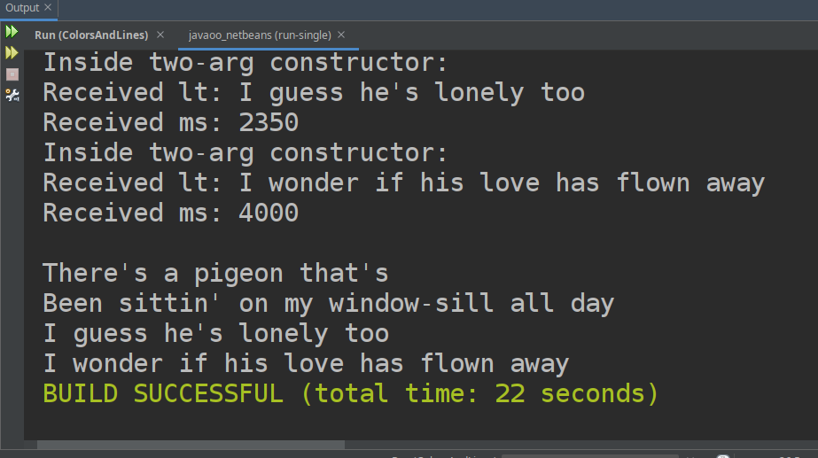

# loretta_javaoo
Practice repository for uploading code in CIT-130

## Karaoke Project
Designed in real-time with the CIT-130 class at CCAC, Spring '21. 

Demonstrates object modeling of a song containing lyric lines timable down to the milisecond

### Karaoke in action

